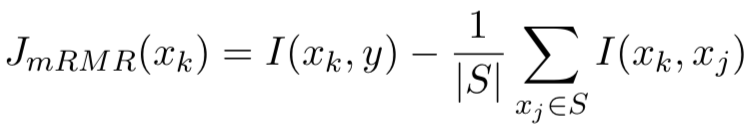

# Feature-Importance-Analysis

Since the features obtained in the early stage of data mining are very heterogeneous, features with low or no relevance not only increase the running time of the model but also significantly reduce the model's accuracy. This project aims to accurately select the features with the highest relevance and rank them in importance using different algorithms.

## mRMR

